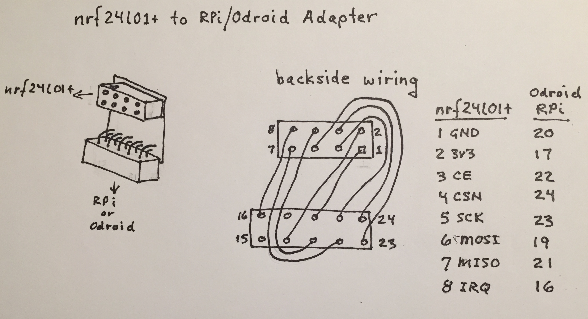

This post documents a small adapter I made to allow the nrf24l01+ to plug directly into the Raspberry Pi 40-pin header.

It uses a small plated-thru pwb and two 2x4 female headers on both ends. It is hand-wired.

The pinout is as follows:

| nrf24l01+ | RPi | WiringPi |
| :--- | :---: | :---: |
| 1 - GND | 20 | - |
| 2 - 3v3 | 17 | - |
| 3 - CE | 22 | 6 |
| 4 - CSN | 24 | 10 |
| 5 - SCK | 23 | 14 |
| 6 - MOSI | 19 | 12 |
| 7 - MISO | 21 | 13 |
| 8 - IRQ | 18 | 5 |
