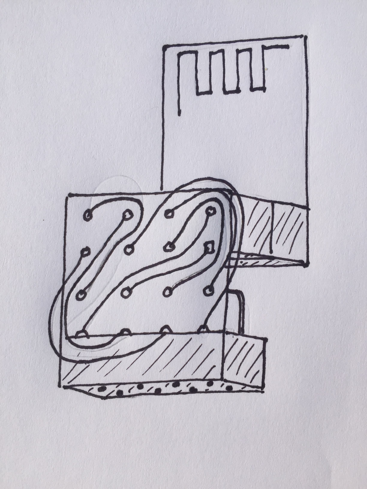

This post documents a small adapter I made to allow the nrf24l01+ to plug directly into the Odroid/Raspberry Pi 40-pin header.

It uses a small plated-thru pwb and a 2x4 female header and a 2x5. It is hand-wired.

