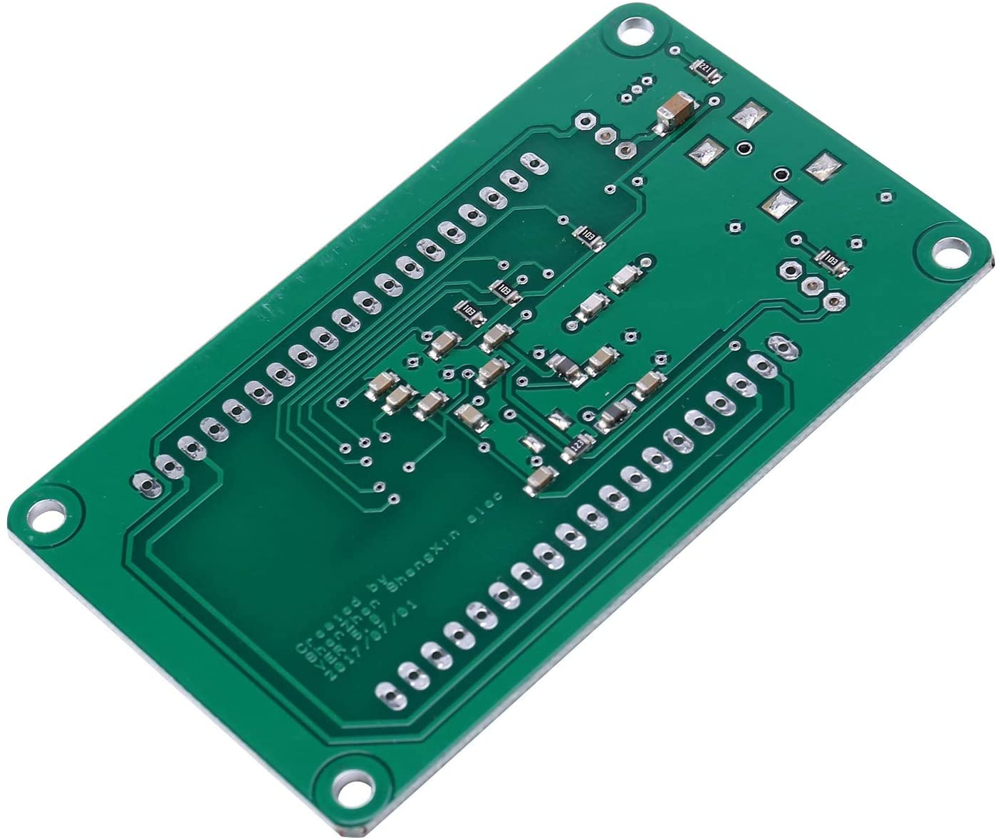

This post documents how I was able to convert a generic FT2232HL Break-out board (BoB) to act as a Digilent JTAG-SMT1 JTAG adapter. The adapter is recognized by Xilinx ISE 14.7 Impact programmer and by Vivado 2020.2 xsct app.

The unmodified (eeprom-wise) BoB should work as an interface (adapter) under OpenOCD for JTAG and SWD. And work as a boundary scan adapter with the appropriate software.

I develop under Arch Linux. I have Xilinx 14.7 ISE installed on my PC and I run Xilinx Vivado 2020.2 as a VirtualBox VM with Ubuntu 20.04.2 LTS.

The high level steps necessary to accomplish this conversion are:
* Purchase FT2232HL BoB and add headers
* Acquire tools and binary to flash eeprom on FT2232HL BoB
* Check BoB accessibility
* Save old eeprom contents
* Flash new contents to eeprom
* Verify BoB is recognized as JTAG programmer
* Show the pin-out to UUT JTAG connector
* Add UART interface

<br/>
#### THE HARDWARE

Here is what my BoB looks like:

<p align="center">
 
&nbsp; &nbsp;
 
</p>


I bought the BoB from [Aliexpress.](#https://www.aliexpress.com/item/32739198642.html?spm=a2g0s.9042311.0.0.27424c4dmVJ4yw)
One can also purchase it from [Amazon.](#https://www.amazon.com/FT2232HL-Development-USB2-0-Acquisition-FT4232H/dp/B081SSWGMW/ref=sr_1_7?dchild=1&keywords=ft2232hl&qid=1613966621&sr=8-7)

My BoB came with a 512B AT93C66B eeprom. We only use the first 256 bytes. In fact, the flashing tool can only access the first 256 bytes anyway.

You can solder on the headers now if you are a "cup half full" type of gal/guy. Or you can wait until eeprom is programmed. Here is what mine looks like with headers and standoffs:

<p align="center">

</p>

<br/>
#### ACQUIRE THE SOFTWARE TOOLS

I used a flashing program which came with the libftdi package.  So, first, install the libftdi package.

```
$ pikaur -S libftdi
```

**NOTE:** If you want/need to build libftdi from scratch follow the instructions [here.](#https://github.com/sprhawk/libftdi)

This should make the flashing tool 'ftdi_eeprom' available.

```
$ ftdi_eeprom

FTDI eeprom generator v0.17
(c) Intra2net AG and the libftdi developers <opensource@intra2net.com>
Syntax: ftdi_eeprom [...options...] <config-file>
Valid Options:
--device <description>  Specify device to open by description string. One of:
         d:<device node>
         i:<vendor>:<product>
         i:<vendor>:<product>:<index>
         s:<vendor>:<product>:<serial>
--read-eeprom           Read eeprom and write to -filename- from config-file
--build-eeprom          Build eeprom image
--erase-eeprom          Erase eeprom
--flash-eeprom          Flash eeprom
--verbose               Print more information
```

<br/>
#### CHECK BOB ACCESSIBILITY

Plug the BoB into one of your PC USB slots (using a cable - of course).
Now execute the 'lsusb' command and see if the BoB shows up in the list.

```
$ lsusb
  o
  o
  o
Bus 003 Device 026: ID 0403:6010 Future Technology Devices International, Ltd FT2232C/D/H Dual UART/FIFO IC
  o
  o
  o
```

A vendor:product id of 0403:6010 are what we are looking for.

<br/>
#### SAVE OLD EEPROM CONTENTS

The first thing we want to do is read and save the current/original contents of the eeprom so that we can restore it if we ever need to.
Keep in mind that the current contents could be empty (all FF's). We need to create a 'read configuration file' which we will call 'read_eeprom.conf'. Using your favorite editor place the following four lines into a file named 'read_eeprom.conf'.

```
vendor_id=0x0403
product_id=0x6010
flash_raw=true
filename="ft2232_bob_original.bin"
```

When we execute the ftdi_eeprom command, the eeprom contents will be read and placed in a file named 'ft2232_bob_original.bin'. [Or NOT. If there is an error in reading or the eeprom contents are all FF's no ft2232_bob_original.bin file will be created].

Let's do the read and save...
```
$ ftdi_eeprom --read-eeprom read_eeprom.conf
````

The output of the above command will look like the following if the contents of eeprom are all FF's (which doesn't have a correct checksum). Which means there was nothing to save and we can write new data to eeprom.
```
FTDI eeprom generator v0.17
(c) Intra2net AG and the libftdi developers <opensource@intra2net.com>
FTDI read eeprom: 0
EEPROM size: -1
Checksum Error: aaaa 0000
Malloc failed, aborting
FTDI close: 0
```
The output of the above command will look like the following if the contents of eeprom are valid. The file 'ft2232_bob_original.bin' should have been created.
```
FTDI eeprom generator v0.17
(c) Intra2net AG and the libftdi developers <opensource@intra2net.com>
FTDI read eeprom: 0
EEPROM size: 256
FTDI close: 0
```

You can use hexdump to view the newly created file with the original eeprom contents. And it will look something like the following listing - but not this close ;-).


```
$ hexdump -C ft2232_bob_original.bin  
00000000  01 01 03 04 10 60 00 07  80 2f 08 00 00 00 9a 12  |.....`.../......|  
00000010  ac 34 e0 1a 00 00 00 00  56 00 01 00 c7 92 6a 35  |.4......V.....j5|  
00000020  51 01 80 30 4a 74 61 67  53 6d 74 31 00 00 00 00  |Q..0JtagSmt1....|
00000030  00 00 00 00 00 44 69 67  69 6c 65 6e 74 20 4a 54  |.....Digilent JT|
00000040  41 47 2d 53 4d 54 31 00  00 00 00 00 00 00 00 00  |AG-SMT1.........|
00000050  00 00 01 00 00 00 00 00  00 00 00 00 00 00 00 00  |................|
00000060  00 00 00 00 00 00 00 00  00 00 00 00 00 00 00 00  |................|
00000070  00 00 00 00 00 00 00 00  00 00 00 00 00 00 00 00  |................|
00000080  00 00 00 00 00 00 00 00  00 00 00 00 00 00 00 00  |................|
00000090  00 00 00 00 00 00 00 00  00 00 12 03 44 00 69 00  |............D.i.|
000000a0  67 00 69 00 6c 00 65 00  6e 00 74 00 34 03 44 00  |g.i.l.e.n.t.4.D.|
000000b0  69 00 67 00 69 00 6c 00  65 00 6e 00 74 00 20 00  |i.g.i.l.e.n.t. .|
000000c0  41 00 64 00 65 00 70 00  74 00 20 00 55 00 53 00  |A.d.e.p.t. .U.S.|
000000d0  42 00 20 00 44 00 65 00  76 00 69 00 63 00 65 00  |B. .D.e.v.i.c.e.|
000000e0  1a 03 32 00 31 00 30 00  32 00 30 00 33 00 38 00  |..2.1.0.2.0.3.8.|
000000f0  35 00 39 00 32 00 38 00  39 00 02 03 00 00 7b 6e  |5.9.2.8.9.....{n|
```

<br/>
#### FLASH NEW CONTENTS TO EEPROM

It is time to create another configuration file. This one will be used to write the new eeprom contents. We will copy the previous config file and then edit it to point to the binary file that we want to flash to eeprom.
```
$ cp read_eeprom.conf flash_eeprom.conf
```
Edit 'flash_eeprom.conf' and change the filename line to point to a new file called ft2232_bob_new.bin. The contents of 'flash_eeprom.conf' looks like this:
```
vendor_id=0x0403
product_id=0x6010
flash_raw=true
filename="ft2232_bob_new.bin"
```
Where are we going to get the binary file to flash to eeprom? Well, the hexdump above shows what needs to be flashed to eeprom. One can create a binary file from the above listing using a hex editor or one might be able to get the file [here](../img/ft2232hl_bob_new.bin).

Once you have the binary file execute the following command:
```
$ ftdi_eeprom --flash-eeprom flash_eeprom.conf

FTDI eeprom generator v0.17
(c) Intra2net AG and the libftdi developers <opensource@intra2net.com>
FTDI read eeprom: 0
EEPROM size: 256
Used eeprom space: 238 bytes
FTDI write eeprom: 0
FTDI close: 0
```

That's it! The BoB should be ready for testing. Probably need to unplug and plug it back in, though.

<br/>
#### IS IT RECOGNIZED?

Let's see if the newly modified BoB is recognized as a JTAG adapter...

```
$ dadutil enum
Found 1 device(s)

Device: JtagSmt1
    Device Transport Type: 00020001 (USB)
    Product Name:          Digilent JTAG-SMT1
    User Name:             JtagSmt1
    Serial Number:         210203859289
```

The program 'dadutil' is part of the AUR Digilent package installation. If you don't have it, then install the following packages.
```
$ pikaur -S digilent.adept.runtime digilent.adept.utilities
```
<br/>
#### THE PINOUT TABLE

Connect the FT2232HL BoB to a Unit Under Test (UUT) JTAG connector according to the following table:

| BoB pin     | UUT JTAG pin  |
|:----------:|:------------:|
| ADBus 0     | TCK           |
| ADBus 1     | TDI           |
| ADBus 2     | TDO           |
| ADBus 3     | TMS           |
| GND         | GND           |

<br/>
#### ADD UART INTERFACE

If you want to add a UART interface to the 2nd channel of the BoB, then you need to patch 3 bytes shown in the table below into the ft2232hl_bob_new.bin file and flash the eeprom again.

```
$ vim -b ft2232_bob_new.bin
```
<br/>
| Address | WAS  | IS   |
|:--------|:----:|:----:|
| 0x0001  | 0x01 | 0x08 |
| 0x00FE  | 0x7B | 0xFB |
| 0x00FF  | 0x6E | 0x6A |

<br/>

```
$ ftdi_eeprom --flash-eeprom flash_eeprom.config
```

The instructions are also at this [link.](#https://gist.github.com/FrancisGuo/20c2c6df8e9f72fe295b785798e2fb41)

The pinouts for the added UART are in the following table.

| BoB pin | Function |
|:--------|:----:|
| CDBus 0  | TX |
| CDBus 1  | RX |

<br/>

[Links]

[Patch the 2nd interface to become an UART](#https://gist.github.com/FrancisGuo/20c2c6df8e9f72fe295b785798e2fb41)

[Another place to get the new binary](#http://jumpstart.webfactional.com/#content)

[Build libftdi/ftdi_eeprom from repo](#https://libftdi.developer.intra2net.narkive.com/zvykxTYu/reading-writing-ft4232-eeprom)
